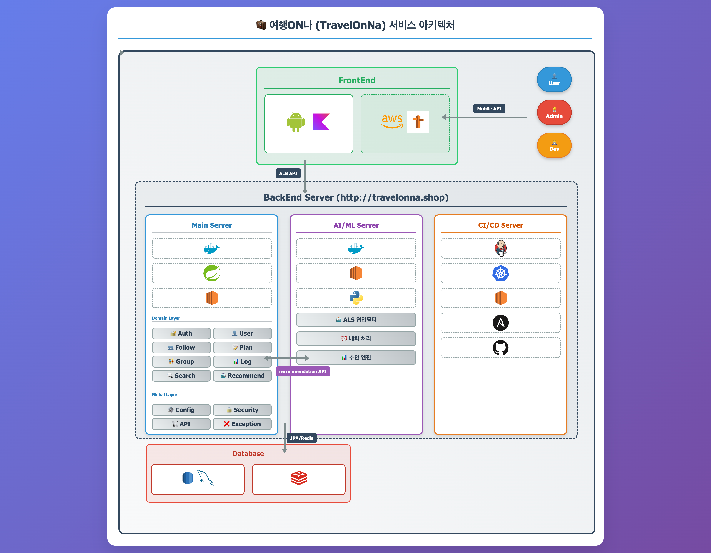

# <a href="#" target="_blank">여행ON나 (TravelOnNa)</a>: AI 기반 소셜 관광 플랫폼 AI


**여행ON나 플랫폼의 AI 기반 개인화 추천 시스템**

##  프로젝트 개요

TravelOnNa AI 추천시스템은 **협업 필터링(ALS Algorithm)**을 기반으로 사용자의 여행 취향을 분석하여 개인화된 여행지를 추천하는 마이크로서비스입니다.

### 핵심 특징
-  **ALS 기반 협업 필터링**: 사용자-아이템 상호작용 데이터 학습
-  **지역별 특화 모델**: 수도권/강원/영남/호남/제주 지역별 최적화
-  **실시간 추천**: FastAPI 기반 고성능 API 서비스
-  **자동 배치 처리**: 주기적 모델 업데이트 및 재학습
-  **컨테이너 기반**: Docker/Kubernetes 배포 지원

##  시스템 아키텍처



##  주요 기능

### 1. 개인화 추천
- **협업 필터링**: ALS(Alternating Least Squares) 알고리즘 활용
- **지역별 모델**: 수도권, 강원, 영남, 호남, 제주 지역별 특화
- **실시간 추천**: 사용자 요청 시 즉시 추천 결과 제공

### 2. 데이터 전처리
- **지역별 데이터 분석**: 각 지역 특성 반영한 전처리 파이프라인
- **사용자-아이템 매트릭스**: 협업 필터링을 위한 sparse matrix 생성
- **데이터 품질 관리**: 이상치 제거 및 정규화

### 3. 배치 처리
- **모델 재학습**: 새로운 사용자 데이터 기반 주기적 학습
- **성능 모니터링**: 추천 정확도 및 시스템 성능 추적
- **자동화 스케줄링**: cron 기반 배치 작업 실행

##  기술 스택

### Backend Framework
- **FastAPI 0.104.1**: 고성능 비동기 웹 프레임워크
- **Uvicorn**: ASGI 서버
- **Pydantic**: 데이터 검증 및 설정 관리

### Machine Learning
- **implicit 0.7.2**: ALS 협업 필터링 라이브러리
- **pandas 2.2.2**: 데이터 조작 및 분석
- **numpy 2.0.2**: 수치 계산
- **scikit-learn 1.6.1**: 머신러닝 유틸리티

### Database & Caching
- **MySQL**: 사용자 데이터 및 여행지 정보 저장
- **Redis 5.0.1**: 추천 결과 캐싱
- **SQLAlchemy 2.0.23**: ORM

### DevOps & Deployment
- **Docker**: 컨테이너화
- **Kubernetes**: 오케스트레이션
- **Jenkins**: CI/CD 파이프라인
- **Ansible**: 자동화 배포

### 서비스 확인

```bash
# 헬스체크
curl http://localhost:8001/health

# API 문서
open http://localhost:8001/docs
```

##  API 문서

### 주요 엔드포인트

| Method | Endpoint | Description |
|--------|----------|-------------|
| `GET` | `/` | 서비스 루트 정보 |
| `GET` | `/health` | 헬스체크 |
| `POST` | `/recommendations` | 개인화 추천 |
| `GET` | `/docs` | Swagger UI |

### 추천 API 예시

```bash
# 사용자 추천 요청
curl -X POST "http://localhost:8001/recommendations" \
  -H "Content-Type: application/json" \
  -d '{
    "user_id": 123,
    "type": "log",
    "limit": 50
  }'
```

##  팀 정보

**TravelOnNa Development Team**
- **AI/ML**: 추천 알고리즘 개발 및 최적화
- **Backend**: Spring Boot 기반 메인 서비스 개발
- **Android**: Kotlin 기반 네이티브 모바일 앱 개발
- **DevOps**: Jenkins/Ansible/Kubernetes 기반 배포 자동화